# USING LIST, SET, TUPLES IN PYTHON

## TABLE OF CONTENTS
- [INTRO](#intro)
- [OBJECTIVES](#objectives)
- [LIST](#list)
- [TUPLES](#tuples)
- [SET](#set)

## INTRO
 This project introduces three important and relatable data structures in python: lists, set and tuples.
In each of these sections, their meaning, how to use them and when to use them in real programs will be explained.
 
## OBJECTIVES
* Understand the difference between list, set and tuple.
* How to create, access and use each datatype.
* Knowing when to use a list, set and a tuple.
* Application to python projects.

## LIST
 The List is the ordered collection of editable data.
 ### CREATING A LIST
A list is created using the square brackets "[ ]".
E.g., fruits = [_apple, banana, coconut, orange_]
 ### ACCESSING A LIST
As stated above in the definition, a list can be edited allowing us to add, remove, count and sort the data in the list.
It gives us the advantage to manipulate the data in however form we wish.
In python, to access a particular item in a list, do this:
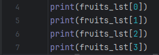

Also, in accessing a list, you can use special functions like getting all the elements out (either from the front or back) or retrieving elements from one point to the other.
SELECTING ALL ITEMS (FROM THE FRONT)

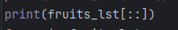

SELECTING ALL ITEMS (FROM THE BACK)

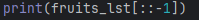

SELECTING FROM ONE POINT TO ANOTHER

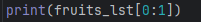

This "print(fruits_lst[0])" brings out the first element in the list. The same thing goes for the other numbers, i.e., 
0 - first element, 1 - second element
 ### ADDING ITEM IN LIST.
To add an element to a list, do the following:
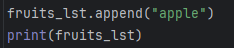

You use ".append" after the name of the list to add elements.
 ### REMOVING ITEM FROM LIST.
To remove an element from a list, do this:
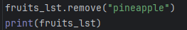

You use ".remove" after the name of the list to remove an element from a list.
 ### WHEN TO USE A LIST
1. Use a list when order is required in a project.
2. Use a list when you need to update values.
3. Lastly, for storing elements like names, scores or items in a basket.

## TUPLES
A tuple is similar to a list, but the major difference is that it cannot be changed or edited once created.
Tuples can be stated as immutable since they don't change.
 ### CREATING A TUPLE.
A tuple is created using the brackets ().
E.g., fruits = (_apple, banana, coconut, orange_)
 ### ACCESSING A TUPLE.
To access an element from a tuple,do this:

 ### WHEN TO USE A TUPLE.
1. Use a tuple when it is for fixed data.E.g. months, date, coordinates, e.t.c.
2. Use a tuple when you don't want any accidental changes in your project
3. Lastly, a tuple can be used when you need faster performance than a list.

## SET
A set is also a collection of items and elements, but they are not ordered. They can also be altered or edited.
 ### CREATING A SET.
To create a set, you use curly brackets "{}" to store the items.
E.g., fruits = {_apple, banana, coconut, orange_}
 ### ADDING AND REMOVING AN ITEM IN A SET.
Add an element to a set by using ".add" at the end of the set name.
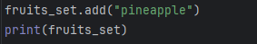

Remove an element from a set by using ".remove" at the end of the set name.
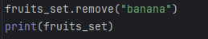

 ### WHEN TO USE A SET.
1. Use a set when you want only unique values.
2. When you want to remove duplicates.
3. And when checking membership.(i.e. if an element is a member of a set)

## APPLICATION IN PYTHON PROJECTS
> NOTE:
> If you type print(len(_name of list, set or tuple_)), this will bring out the total number of items found in the given list, set or tuple.
> Also, you can use boolean data types in a list. To check membership of an element using the keyword "in" will be necessary. 
 
>FUNCTION NAME
> - List - list()
> - Set - set()
> - Tuples - tuples()

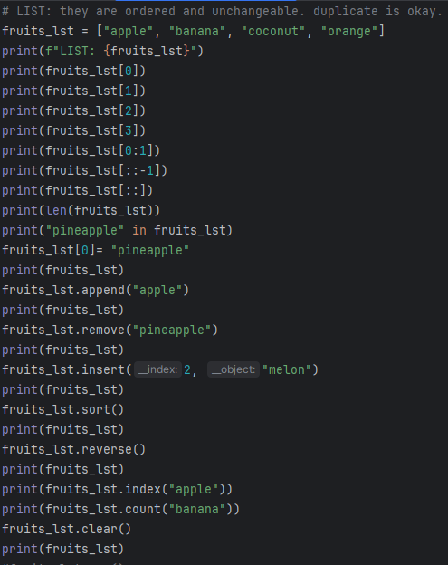

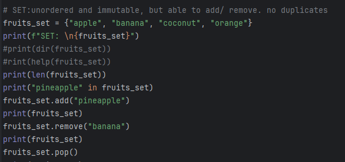

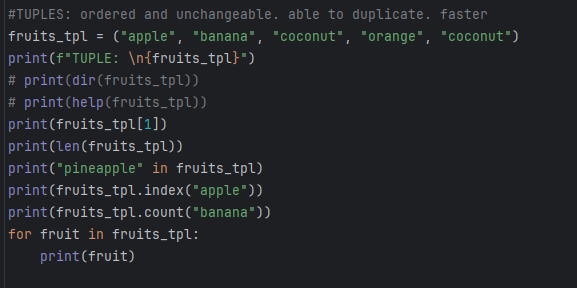

## EXERCISES. 
1. Create a list of five items and remove the third one.
2. Create a tuple with your name, age, best color, country.
3. Create a set with numbers that include duplications and print the result.
4. Convert a list to a set to remove duplicates.
5. Access the second item in a list and a tuple.